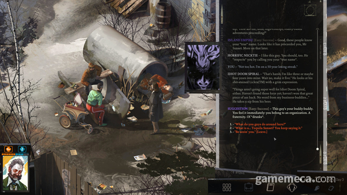
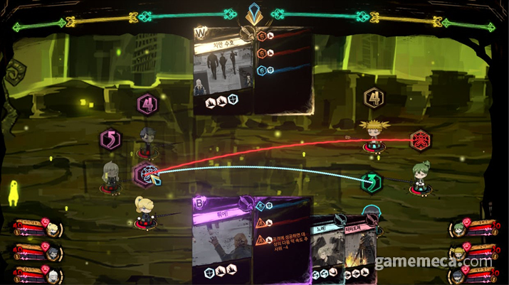
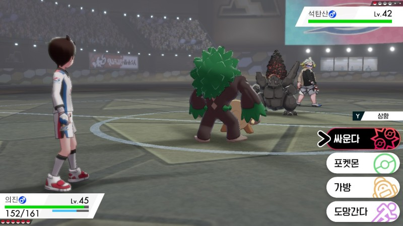
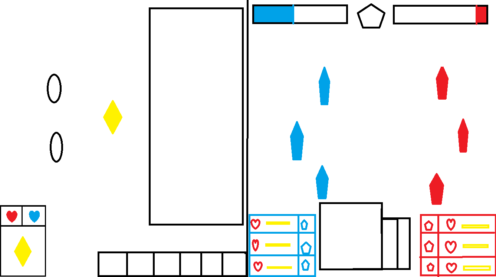

# 컨셉
## 메인컨셉 : 파트너
### 성장
- 유대감을 쌓거나 전투를 통해 성장한다.

### 키워드
- 파트너는 3개의 키워드를 가지고있다.
- 불의 정령 : 불 , 자연 , 정령

### 파트너 기술
- 키워드와 연관된 기술을 가지고있다.
- 여러 기술 중 9개의 기술을 선택해 전투중 사용할 덱을 생성한다.

---

## 서브 컨셉 : 자원
### 스탯
- 육체, 운동, 지성, 감성 
- 5등급으로 나눠진다.
- A > B > C > D > E
- 한번 정해진 스탯은 변동이 불가능하다

### 기술
- 스탯에 따른 기술 최대치가 정해진다.
- 5 , 4 , 1 , 2 의 스탯의 경우 힘과 관련된 기술은 최대 5번 강화 가능하다.
- 숙련도에 따라 선택지의 확률이 달라진다.
- 숙련도1의 기술의 경우 10%이하의 낮은 확률로 성공한다.

### 시간
- 챕터마다 매 목표가 제시되고 제한된 시간안에 목표를 달성해야한다.
- 실패시 패널티 or 배드엔딩을 볼수있다.

---

## 서브 컨셉 : 전략
### 아이템
- 각 부위당 1개의 아이템을 장착 가능하다.
- 아이템의 효과는 스탯과 기술의 증감한다.
- 운동화 - 운동 + 1 , 감성 -1 

### 덱
- 배틀파트에서 자신의 차례가 될시 생성한 덱에서 랜덤하게 3장의 카드를 뽑는다.

### 동료
- 전투에 2명의 동료를 데려 갈 수 있다.
- 단점을 극대화 하거나 장점을 커버하는 전략을 짤 수 있다.

---

## 서브 컨셉 : 선택
### 유대감
- NPC와 대화를 통해 유대감을 쌓고 동료로 영입할 수 있다.
- 파트너와 대화 , 선택지에 따라 유대감을 쌓는다.

### 엔딩
- 잘못된 선택이 쌓일 시 BED 엔딩이 나온다.
- 누적된 선택지에 따라 게임의 엔딩이 달라진다.

---

# [관련 이미지 & 동영상]
## 이미지  
- 일상씬

- 전투씬

## 동영상

---

  
# [대표 이미지]

<!--
  
# [컨셉 & 대표이미지 기반 작품묘사]
> ### 대표이미지 기반 :
> ### 컨셉 기반:
-->

  
# [<게임제목> 구성 요소]
- 메커니즘
- 이야기
- 미적요소

 

## 1. 메커니즘

[도전 과제]
- 일상씬
1) 생존과 현 상황을 파악하기 위해 정보와 동료를 구한다.

2) 대화 선택에 실수를 하면 체력/정신력이 떨어지고 0이될경우 배드엔딩이 된다.

3) 잘못된 선택을 반복할경우 동료가 될 캐릭터와 싸울수있다.

4) 아이템 착용, 기술 습득을 하고 배틀파트에 사용할 덱을 편집한다.

- 전투씬
1) 일상씬에서 정한 동료와 덱을 가지고 적과 싸운다.

2) 화면 하단에 적과 동료의 상태를 보고 설정한 덱을 전략적으로 사용한다.

3) 상단의 게이지가 가득 차면 필살기, 특수기를 사용할수 있다.

4) 승리시 일상파트로 넘어와 스토리가 진행되고 패배시 배드엔딩이 나타난다.

[재미 요소]
- 일상씬
1) 같이 스토리를 진행할 동료를 선택할수있다.

2) 정해진 대사를 보기만 하는것이 아닌 유저가 대화선택지를 고를 수있고 그에따른 결과가 다르다.

3) 배틀씬에 사용할 파트너 덱을 본인의 전략에 따라 컨셉에 맞게 생성할수있다.

4) 장착한 아이템이 캐릭터에 적용되어 나타난다.

- 배틀씬
1) 적이 사용하는 기술에 따라 사용할 기술을 정해 전략적이다.

2) 캐릭터마다 정해진 인내치 이상의 공격을 받을 경우 그로기 상태가 되어 추가적인 대미지를 받는다.

3) 일정한 지형이 있어 추가적인 효과를 받는다.
 
벽과 부딪치면 추가 대미지를 받는다.

 

---

## 2. 이야기

### [스토리]  
> Hidden 스토리
- 세상을 파괴하려는 적을 막으려고 영웅을 만드는 시뮬레이션 기계에 끌려온다.
  최후의 적을 이길 확률이 낮을경우 시간을 되돌려 무한반복하는 스토리
- 여러 주인공의 엔딩을 봐야 진행할수있다

> Nomal 스토리
- 각자의 삶을 살던 주인공과 동료들이 파트너를 얻어 생존게임을 시작한다
 - 최후의 생존자가 되기 위해 성장하는 스토리

<!--
### [카메라 관점]  
- 탑뷰
-->
 

---

## 3. 미적요소

### [디자인]  
- 주인공이 장비를 장착시 그에 따른 외관이 변화한다
- 공격에 따른 이펙트가 다르다

### [음향]  
- 일상파트는 주로 잔잔한 배경음
- 배틀파트는 주로 긴박하고 웅장한 배경음 피격시 효과음이 있다
