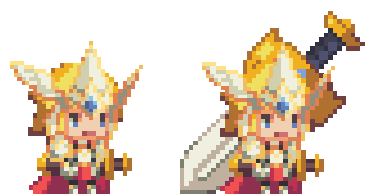
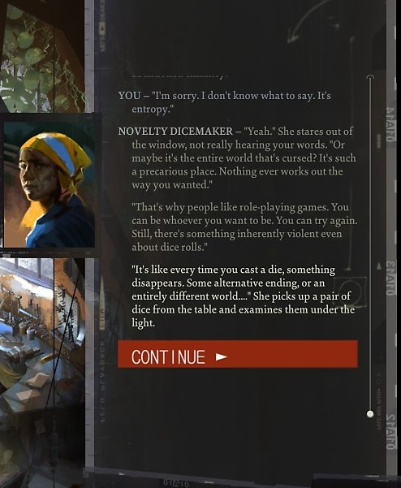

# 목차
[1. 게임명](#게임명) 
[2. 컨셉](#컨셉) 
[3. 관련 이미지 & 동영상](#관련-이미지-&-동영상) 
[4. 대표 이미지](#대표-이미지) 
[5. 컨셉 and 대표이미지 기반 작품묘사](#컨셉-and-대표이미지-기반-작품묘사) 
[6. 구성 요소](#구성-요소) 
[7. 게임시스템디자인](#게임시스템디자인) 
[a. 게임 오브젝트 분해](#게임-오브젝트-분해) 
[b. 파라미터(속성)](#파라미터속성) 
[c. 행동](#행동) 
[d. 상태](#상태) 
[e. 플레이어 캐릭터 속성(파라미터)](#플레이어-캐릭터-속성파라미터) 
[f. 게임의 규칙](#게임의-규칙) 
[g. 게임에서 사용될 공식](#게임에서-사용될-공식) 
[8. 개발 요구사항 & 흐름도](#개발-요구사항-&-흐름도) 
[a. 요구사항](#요구사항) 
[b. 시간별 흐름도](#시간별-흐름도) 
[c. 키보드 이벤트에 대한 흐름도](#키보드-이벤트에-대한-흐름도) 
[d. 용어정리](#용어정리) 
[9. 스토리보드](#스토리보드) 
[10. 개발작업 일정(6주)](#개발작업-일정) 
# 개발일지
[1주차 개발일지](https://github.com/PRPG-PCU/PRPG-PCU.github.io/blob/master/files/week1/index.md) 
[2주차 개발일지](https://github.com/PRPG-PCU/PRPG-PCU.github.io/blob/master/files/week2/index.md) 
[3주차 개발일지](https://github.com/PRPG-PCU/PRPG-PCU.github.io/blob/master/files/week3/index.md) 
[4주차 개발일지](https://github.com/PRPG-PCU/PRPG-PCU.github.io/blob/master/files/week4/index.md) 

# 게임명
Eterner Return
# 컨셉

## 메인컨셉 : 파트너

### 성장
- 유대감을 쌓거나 전투를 통해 성장한다.

### 키워드
- 파트너는 3개의 키워드를 가지고있다.
- 불의 정령 : 불 , 자연 , 정령

### 파트너 기술
- 키워드와 연관된 기술을 가지고있다.
- 여러 기술 중 9개의 기술을 선택해 전투중 사용할 덱을 생성한다.

---

## 서브 컨셉 : 자원

### 스탯
- 육체, 운동, 지성, 감성 
- 5등급으로 나눠진다.
- A > B > C > D > E
- 한번 정해진 스탯은 변동이 불가능하다

### 기술
- 스탯에 따른 기술 최대치가 정해진다.
- 5 , 4 , 1 , 2 의 스탯의 경우 힘과 관련된 기술은 최대 5번 강화 가능하다.
- 숙련도에 따라 선택지의 확률이 달라진다.
- 숙련도1의 기술의 경우 10%이하의 낮은 확률로 성공한다.

### 시간
- 챕터마다 매 목표가 제시되고 제한된 시간안에 목표를 달성해야한다.
- 실패시 패널티 or 배드엔딩을 볼수있다.

---

## 서브 컨셉 : 전략

### 아이템
- 각 부위당 1개의 아이템을 장착 가능하다.
- 아이템의 효과는 스탯과 기술의 증감한다.
- 운동화 - 운동 + 1 , 감성 -1 

### 덱
- 배틀파트에서 자신의 차례가 될시 생성한 덱에서 랜덤하게 3장의 카드를 뽑는다.

### 동료
- 전투에 2명의 동료를 데려 갈 수 있다.
- 단점을 극대화 하거나 장점을 커버하는 전략을 짤 수 있다.

---

## 서브 컨셉 : 선택

### 유대감
- NPC와 대화를 통해 유대감을 쌓고 동료로 영입할 수 있다.
- 파트너와 대화 , 선택지에 따라 유대감을 쌓는다.

### 엔딩
- 잘못된 선택이 쌓일 시 BED 엔딩이 나온다.
- 누적된 선택지에 따라 게임의 엔딩이 달라진다.

---

# [관련 이미지 & 동영상]

## 이미지  
- 일상씬
 

- 전투씬
 

## 동영상 

---

  

# [대표 이미지]

  

# [컨셉 and 대표이미지 기반 작품묘사]

> ### 대표이미지 기반 : 

> ### 컨셉 기반:
월드씬에서 사람과 사물과 상호작용하고 배틀씬에서 사용할 파트너덱을 만든다.

배틀씬에서 전략적인 싸움을 요구한다.

 

# [구성 요소]

## 메커니즘

[도전 과제]
- 월드씬 
1) 생존과 현 상황을 파악하기 위해 정보와 동료를 구한다.

2) 대화 선택에 실수를 하면 체력/정신력이 떨어지고 0이될경우 배드엔딩이 된다.

3) 잘못된 선택을 반복할경우 동료가 될 캐릭터와 싸울수있다.

4) 아이템 착용, 기술 습득을 하고 배틀파트에 사용할 덱을 편집한다.

- 전투씬 
1) 일상씬에서 정한 동료와 덱을 가지고 적과 싸운다.

2) 화면 하단에 적과 동료의 상태를 보고 설정한 덱을 전략적으로 사용한다.

3) 상단의 게이지가 가득 차면 필살기, 특수기를 사용할수 있다.

4) 승리시 일상파트로 넘어와 스토리가 진행되고 패배시 배드엔딩이 나타난다.

[재미 요소]
- 월드씬 
1) 같이 스토리를 진행할 동료를 선택할수있다.

2) 정해진 대사를 보기만 하는것이 아닌 유저가 대화선택지를 고를 수있고 그에따른 결과가 다르다.

3) 배틀씬에 사용할 파트너 덱을 본인의 전략에 따라 컨셉에 맞게 생성할수있다.

4) 장착한 아이템이 캐릭터에 적용되어 나타난다.

- 배틀씬 
1) 적이 사용하는 기술에 따라 사용할 기술을 정해 전략적이다.

2) 캐릭터마다 정해진 인내치 이상의 공격을 받을 경우 그로기 상태가 되어 추가적인 대미지를 받는다.

3) 일정한 지형이 있어 추가적인 효과를 받는다. 
벽과 부딪치면 추가 대미지를 받는다.

 

---

## 이야기

### [스토리]  
> Hidden 스토리
- 세상을 파괴하려는 적을 막으려고 영웅을 만드는 시뮬레이션 기계에 끌려온다. 
최후의 적을 이길 확률이 낮을경우 시간을 되돌려 무한반복하는 스토리
- 여러 주인공의 엔딩을 봐야 진행할수있다

> Nomal 스토리
- 각자의 삶을 살던 주인공과 동료들이 파트너를 얻어 생존게임을 시작한다
 - 최후의 생존자가 되기 위해 성장하는 스토리

 

---

## 미적 요소

### [디자인]  
- 주인공이 장비를 장착시 그에 따른 외관이 변화한다
- 공격에 따른 이펙트가 다르다

### [음향]  
- 일상파트는 주로 잔잔한 배경음
- 배틀파트는 주로 긴박하고 웅장한 배경음 피격시 효과음이 있다

  

# 게임시스템디자인

## 게임 오브젝트 분해

|연번|오브젝트 이름|오브젝트 이미지|
|---|---|---|
|1|주인공||
|2|파트너(샐러맨더)||
|3|대화창||
|4|기술 카드(자연화)||
|5|기술 덱||
|6|전투 필드||
|7|장비||
|8|상태창||
|9|능력창||

  

## 파라미터(속성)

1) 오브젝트 이름 : 주인공

|속성|속성값|설명|비고|
|---|---|---|---|
|이름|주인공|캐릭터 생성 시 유저가 정할 수 있다.|
|파트너|샐러맨더|키워드로 불, 정령, 자연을 가지고 있다. 각 키워드에 관련된 기술을 선택해 덱을 짤 수 있다.|
|지성|1|지성은 4종류로 논리, 지식, 창의, 분석 NPC와의 대화선택지 중 정보를 쉽게 획득가능|
|논리|1|사건을 재구성하거나 상대의 논리의 헛점을 파고들 수 있다|
|지식|1|플레이어가 모르는 게임 상 설정들에 대해서 자세히 알려준다. |
|창의|1|다양한 상황이나 사물, 단어를 다른 말로 정의해주는 식의 설명을 붙여 준다.|
|분석|1|시각적 증거를 토대로 무언가를 분석하는대 영향을 미친다.|
|감성|2|감성은 4종류로 의지, 공감, 권위, 문화 MP, 정신력과 관련되 있다.|
|의지|2|주의가 흐트러지는 상황에서 더 집중할 수 있는 정신력을 상징한다. 정신력 수치와 동일하며 정신력 수치가 0이 될시 게임오버|
|공감|2|상대의 마음을 알아차리고 상대가 무슨 감정과 생각을 해내는지 유추한다. 능력치가 높으면 상대방이 느끼는 감정을 실시간으로 알아챌 수 있다.|
|권위|2|상대와의 관계에서 우위를 점하고, 사람간의 상하적 관계를 유추한다. 기싸움에서 우위를 점할수 있다.|
|문화|2|한 집단이 어떤 생각이나 결속력을 가지고 있는지 알아차리고 조직문화를 꿰뚫어본다.|
|육체|5|육체는 4종류로 체력, 물리, 직감, 투쟁 HP, 인내, 힘 등 육체적인 행동과 관련 된다.|
|체력|5|부정적인 신체적 자극을 버틸 수 있다. 생명수치와 동일하면 생명수치가 0이 되면 사망한다.|
|물리|5|힘을 쓰는 등 육체적 능력을 잘 발휘한다. 전투 외에도 무언가를 부수거나 몸에 순간적으로 힘을 주는 경우에도 사용|
|직감|6|어떤 초현실적인 것을 민감하게 알아차릴 수 있다. 아무것도 아닌 벽을 보고 단서를 읽거나 미래를 예지|
|투쟁|5|상대를 압박하거나 협박할 수 있다.|
|운동|4|운동은 4종류로 협응력, 지각, 반응, 조작 무언가 상호작용하는대 +요인을 얻는다|
|협응력|4|눈과 손을 기민하게 다루며, 총을 잘 쏠 수 있다.|
|지각|4|시각, 후각, 청각등의 감각을 통해 민감하게 알아차릴 수 있다.|
|반응|4|상대의 행위에 민첩하게 대응할 수 있다.|
|조작|4|기계나 장치를 잘 다루고 쉽게 조작할 수 있다|
|생명|5|월드씬의 HP, 0이되면 사망한다.|
|정신|2|월드씬의 WP, 0이되면 사망한다.|
|HP|50|배틀씬의 HP, 0이되면 사망한다.|
|WP|20|배틀씬의 WP, 0이되면 그로기상태가 된다.|
|속도|4|속도~6의 주사위를 던진다.|

2) 오브젝트 이름 : 파트너

|속성|속성값|설명|비고|
|---|---|---|---|
|이름|샐러맨더|파트너의 이름||
|키워드|불, 정령, 자연|파트너덱에 사용할 카드 키워드||
|설명|---|샐러맨더에 대한 정보가 들어있다.||
|덱|불뿜기, 불저항,동화, 토템 등|샐러맨더가 현재 가지고있는 카드들을 보여준다.||

3) 오브젝트 이름 : 대화창

|속성|속성값|설명|비고|
|---|---|---|---|
|대사|---|스토리 및 정보|
|선택지|1.그냥 간다 2. 함께 간다 3. 싸운다|1번 선택시 혼자서 진행한다 2번 선택시 임시로 동료가 되어 진행한다 3번 선택시 적이 되어 싸운다|
|상호작용|1. 바위를 부순다 2. 돌아간다|1번 선택시 확률에 따라 돌을 부수고 진행한다. 실패시 생명이 떨어진다 2번 선택시 상호작용을 취소한다.|
|확률|90%|물리 능력치로 바위를 부수는 행위에 보정|

4) 오브젝트 이름 : 기술 카드

|속성|속성값|설명|비고|
|---|---|---|---|
|이름|자연화|기술 카드의 이름|
|코스트|2|사용하는대 드는 자원|
|키워드|정령|기술 카드의 속성|
|공격력|0|공격 기능이 없다|
|방어력|0|방어 기능이 없다|
|회피|0|회피 기능이 없다|
|설명|물리 공격에 면역상태가 된다|기술 설명|

5) 오브젝트 이름 : 기술 덱

|속성|속성값|설명|비고|
|---|---|---|---|
|크기|4|선택된 기술카드의 갯수|
|카드|불뿜기|불 – 불뿜기(불 데미지)|
|카드|불저항|불, 자연 – 불 저항(화염면역, 불속성 데미지 감소)|
|카드|자연화|정령 – 동화(물리면역)|
|카드|토템|정령, 자연 – 토템(마나회복)|

6) 오브젝트 이름 : 전투필드

|속성|속성값|설명|비고|
|---|---|---|---|
|이름|용암지대|필드 이름|
|속성|불, 땅|불속성에 +2 보정, 땅속성에 +1 보정, 물속성 –2 보정|

  

## 행동

1) 오브젝트 이름 : 주인공

|행동|설명|
|---|---|
|공격|배틀씬에서 공격 카드를 사용할 때 공격모션과 데미지를 준다.|
|회피|배틀씬에서 회피 카드를 사용할 때 회피모션과 데미지를 받지않는다.|
|방어|배틀씬에서 방어 카드를 사용할 때 방어모션과 방어력-공격력의 데미지를 받는다.|
|반격|배틀씬에서 방어,회피 카드를 사용할 때 공격 수치보다 높다면 차이만큼 반격한다.|
|점프|월드씬에서 낮은곳에서 높은곳으로 이동하거나 다리 사이를 건널 때 상호작용한다. 확률 주사위를 던져 실패하면 체력이 떨어진다.|
|달리기|월드씬에서 빠르게 이동할 때 사용한다.|
|뛰어내리기|월드씬에서 높은곳에서 낮은곳으로 이동할 때 상호작용한다. 확률 주사위를 던져 실패하면 체력이나 정신력이 떨어진다 |
|대화|NPC와 대화를 나누어 정보를 얻거나 퀘스트를 진행한다. 선택지에 따라 결과가 바뀐다|
|거래|상점에서 경험치를 통해 아이템을 사거나 팔 수 있다.|

2) 오브젝트 이름 : 동료, 적, 몬스터

|행동|설명|
|---|---|
|공격|배틀씬에서 공격 카드를 사용할 때 공격모션과 데미지를 준다.|
|회피|배틀씬에서 회피 카드를 사용할 때 회피모션과 데미지를 받지않는다.|
|방어|배틀씬에서 방어 카드를 사용할 때 방어모션과 방어력-공격력의 데미지를 받는다.|
|반격|배틀씬에서 방어,회피 카드를 사용할 때 공격 수치보다 높다면 차이만큼 반격한다.|

3) 오브젝트 이름 : 상점NPC

|행동|설명|
|---|---|
|거래|경험치를 통해 아이템을 사거나 판다.|
|대화|주인공에게 정보, 퀘스트를 준다.|

  

## 상태

1) 오브젝트 이름 : 주인공, 동료, 적

|현상태|전이상태|전이조건|
|---|---|---|
|정상 상태|상태이상 상태|약화, 화상, 감전, 출혈 ,동상, 중독 등 상태이상 공격에 당했을 시 |
|정상 상태|그로기 상태|WP가 0이 될 시|
|정상 상태|사망 상태|HP가 0이 될 시|
|정상 상태|각성 상태|이벤트 달성 시 특정 인물이 죽었을 때 특정 아이템을 얻거나 사용했을 때|
|상태이상 상태|정상 상태|약화, 화상, 감전, 출혈 ,동상, 중독 등 상태이상 수치가 0이 되고 그로기 상태가 아닐 시|
|상태이상 상태|그로기 상태|WP가 0이 될 시 상태이상이 유지된다|
|상태이상 상태|사망 상태|HP가 0이 될 시|
|상태이상 상태|각성 상태|이벤트 달성 시 특정 인물이 죽었을 때 특정 아이템을 얻거나 사용했을 때|
|그로기 상태|정상 상태|1턴이 지난다|
|그로기 상태|상태이상 상태|1턴이 지날 때 상태이상 수치가 남아있다.|
|그로기 상태|사망 상태|HP가 0이 될 시|
|그로기 상태|각성 상태|이벤트 달성 시 특정 인물이 죽었을 때 특정 아이템을 얻거나 사용했을 때|
|각성  상태|상태이상 상태|WP가 0이 될시 각성상태가 풀리고 WP가 꽉찬다|
|각성  상태|정상 상태|3턴이 지날 시|
|각성  상태|사망 상태|HP가 0이 될 시|

  

## 플레이어 캐릭터 속성(파라미터)

|속성|영문명칭|설명|비고|
|---|---|---|---|
|레벨|LEVEL|일정 경험치를 소모하여 올릴 수 있다. AP를 획득하기 위한 조건이다.|
|경험치|EXP|상호작용 및 전투로 얻을수 있다. 레벨, 화폐, 상호작용 여러방면으로 쓰인다.|
|스탯|STATUS|한번 정해지면 변동 불가 모든 스탯은 1로 시작 + 보너스 스탯 10개 회차 당 1의 스탯을 더 획득 스탯은 4종류로 육체, 운동, 지성, 감성 6등급으로 나눠짐 S>A>B>C>D>E|S = 6 A = 5  B = 4 C = 3  D = 2 E = 1  *첫 회차는 A등급 까지 가능
|지성|INTELLECT|지성은 4종류로 논리, 지식, 창의, 분석 NPC와의 대화선택지 중 정보를 쉽게 획득가능|
|감성|PSYCHE|감성은 4종류로 의지, 공감, 권위, 문화 MP, 정신력과 관련되 있다.|
|육체|PHYSIQUE|육체는 4종류로 체력, 물리, 직감, 투쟁 HP, 인내, 힘 등 육체적인 행동과 관련 된다.|
|운동|MOTORIC|운동은 4종류로 협응력, 지각, 반응, 조작 무언가 상호작용하는대 +요인을 얻는다|
|능력 포인트|AP|능력은 스탯 + 능력 투자 횟수로 계산된다(최대 12) 스탯과 AP 수치에 따라 선택지에 확률 보정이 들어간다.|
|생명|wHP|월드씬에서 사용되는 HP 육체적인 상호작용에 실패시 1씩 떨어진다.|체력*1|
|정신|wWP|월드씬에서 사용되는 WP 정신적인 상호작용에 실패시 1씩 떨어진다.|의지*1|
|파트너|PARTNER|파트너는 3개의 키워드를 가지고있고 키워드와 관련된 여러 카드중 9장으로 덱을 만든다.|
|HP|bHP|배틀씬에서 사용되는 HP 적의 공격을 얼마나 견뎌낼 수 있는지를 나타내는 수치 값이 0이 되면 캐릭터가 사망한다.|생명*10|
|WP|bWP|배틀씬에서 사용되는 WP 적의 약점공격을 얼마나 견뎌낼 수 있는지를 나타내는 수치 값이 0이 되면 캐릭터가 약화되어 그로기 상태가 된다.|정신*10|
|그로기|Groggy|한턴동안 아무런 행동도 할 수 없다.|
|속도|Speed|배틀씬의 속도주사위를 보정한다.|

  

# 게임의 규칙

  

# 게임에서 사용될 공식

  

# 개발 요구사항 & 흐름도

## 요구사항
시작화면, 로드창, 스탯선택화면, 능력선택화면, 부제화면, 게임화면, 전투화면, 상태창, 파트너창, 덱편집창, 설정창이 있다 
시작화면에는 / 새게임 / 불러오기 / 옵션 / 종료 / 버튼이 있다. 
시작화면에서 새게임 클릭시 스탯선택화면으로 이동한다. 
시작화면에서 불러오기 클릭시 로드창으로 이동한다. 
시작화면에서 옵션 클릭시 설정창으로 이동한다. 
시작화면에서 종료 클릭시 게임이 종료된다. 
로드창에는 화면가운데에 10개의 저장공간이 있다. 
로드창에서 저장한 데이터를 클릭시 시작하기가 활성화된다. 
로드창에는 하단부에 나가기와 시작하기가있다. 
로드창에서 시작하기 클릭시 기존에 저장했던 순간으로 게임화면이 이동한다. 
*이제부터 모든 뒤로가기는 이전 화면으로 이동한다. 
설정창에는 / 화면모드 / 해상도 / 글자크기 / 음량 /을 조절할수 있다. 
설정창에는 / 나가기 / 설정초기화 / 확인 /이 있다. 
설정창에서 설정초기화 클릭시 디폴트상태로 변한다. 
설정창에서 확인 클릭시 변동된 설정이 저장된다. 
설정창에서 나가기 클릭시 변동된 데이터가 있다면 확인하라고 경고창이 뜬후 이전 화면으로 이동한다. 
스탯선택화면에는 / 지성 / 감성 / 육체 / 운동 / 스탯이 있고 각 디폴트 별로 선택되있다. 
스탯선택화면에는 스탯 옆에 화살표와 수치가 적혀있고 총합12의 수치의 스탯을 설정한다. 
스탯선택화면 하단부 에는 뒤로가기, 무작위, 다음이 있다. 
스탯선택화면에서 무작위를 누를시 총합12의 수치를 지성,감성,육체,운동에 랜덤하게 분배된다. 
스탯선택화면에서 다음을 누를시 설정한 스탯을 가지고 능력선택화면으로 이동한다. 
능력선택화면에는 설정한 스탯과 관련된 능력들이 나타나고 대표능력을 선택해야한다. 
지성 - 논리, 지식, 창의, 분석 
감성 - 의지, 공감, 권위, 문화 
육체 - 체력, 물리, 직감, 투쟁 
운동 - 협응력, 지각, 반응, 조작 
능력선택화면에서 능력을 누를시 우측부분에서 해당 능력의 설명과 다음버튼이 생성된다. 
능력선택화면에서 다음버튼 누를시 선택된 대표능력은 +1의 강화효과를 받고 부제화면으로 이동한다. 
부제화면에는 화면 가운데에 간단한 글과 해당 파트를 알려주고 아무 화면 클릭시 게임화면으로 이동한다. 
게임화면 전체에 맵이 깔려있고 카메라는 주인공을 중심으로 잡혀있다. 
게임화면 왼쪽 하단부에 캐릭터의 현재 상태가 나타난다. 
게임화면 오른쪽 하단부에 / 상태창 / 파트너창 / 덱편집창 / 설정창 /이 있다. 
게임화면에서 상태창 클릭시 상태창으로 이동한다. 
상태창 왼쪽에 캐릭터의 스탯과 현재 상태가 나타나 있다. 
상태창 가운대에 캐릭터의 부위별 장비상태가 나타나 있다. 
상태창 오른쪽에 장비창이 존재하고 도구 / 옷 / 아이템 /이 있고 클릭시 소지하고 있는 아이템을 보여준다. 
게임화면에서 파트너창 클릭시 파트너창으로 이동한다. 
게임화면에서 덱편집창 클릭시 덱편집창으로 이동한다. 
게임화면에서 설정창 클릭시 설정창으로 이동한다. 
전투화면 상단에는 특수게이지가 있다. 
전투화면 가운데는 왼쪽에 주인공과 동료가 있고 오른쪽에 적이있다. 
캐릭터 하단에는 HP, WP가 있고 상단에는 속도주사위와 사용가능 코스트가 표시된다. 
전투화면 하단에는 왼쪽에 주인공과 동료의 상태가 있고 오른쪽에 적의 상태가 있다. 
아군 캐릭터를 클릭시 하단부에 해단 캐릭터의 기술카드가 나타난다. 
기술카드를 클릭 후 상대캐릭터를 클릭시
적 캐릭터를 클릭시 스탯에 따라 적의 행동을 미리 알려준다. 
캐릭터의 상태는 HP, WP, 상태이상을 보여준다. 
상태이상은 출혈, 중독, 화상, 동상, 감전, 약화 등 여러종류가 있다. 

## 시간별 흐름도

## 키보드 이벤트에 대한 흐름도

## 용어정리

# 스토리보드

# 개발작업 일정

## 1주차 개발일지

1. 모델, 이미지, 사운드 리소스 탐색 20% 

2. 시작화면 구현 80% -> 배경이미지에 특수효과를 구현

3. 스탯선택화면 구현 80% -> 클릭시 변화와 화면이동 구현

4. 화면간 이동 구현 100%

5. 스토리 1차 구현 20% -> 전체틀 구현

6. 캐릭터 이동 구현 50% -> 충돌 구현

## 2주차 개발 일지

1. 배경이미지에 특수효과 구현 ==> 100%

2. 능력선택 화면 구현 ==> 0% (제작 중지)

3. 설정화면 구현 ==> 50%

4. 월드 구현 ==> 50%

5. 메인 화면 구현 ==> 20%

6. 충돌 구현 ==> 50%

## 3주차 개발 일지

1. 설정 씬 구현 ==> 60% (사운드 완성)

2. 메인 씬 ui 간단히만 구현 ==> 70% (상호작용)

3. 대화창 구현 ==> 50% (대화창 틀완성)

4. 사물 및 인물 상호작용 구현 ==> 50% (상호작용버튼 생성)

5. 캐릭터 이동 및 충돌 간 오류 수정 ==> 60% (캐릭터와 월드맵 사이 이동 오류 발생)

6. 각 매니저 싱글톤으로 변경 ==> 50% (매니저 변경에 따른 오류발생)

7. 씬분리 및 병합중 발생하는 오류 수정 ==> 50% (매니저 변경 및 씬분리에 따른 오류 발생)

## 4주차 개발 일지

1. 배틀 씬 구현 ==> 30% (ui제작)

2. 캐릭터 애니메이션 ==> 20% (기본상태 공격상태 구현)

3. 각 매니저 싱글톤으로 변경 ==> 100%

4. 씬분리 및 병합중 발생하는 오류 수정 ==> 100%
